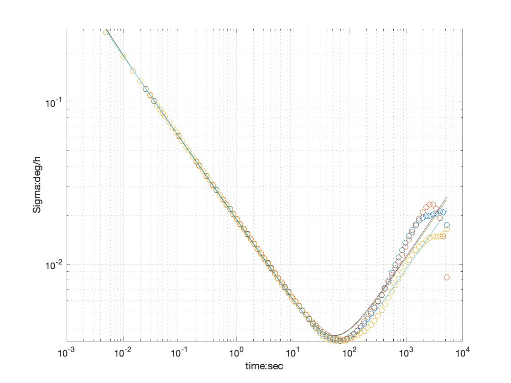
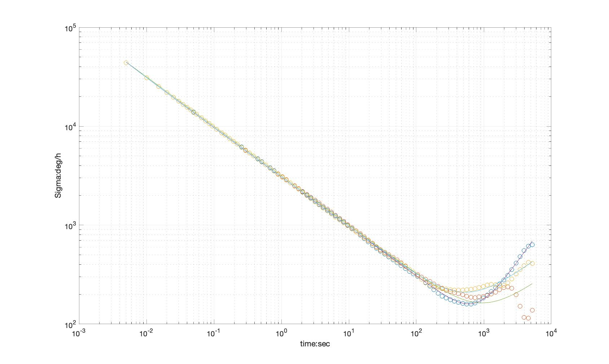
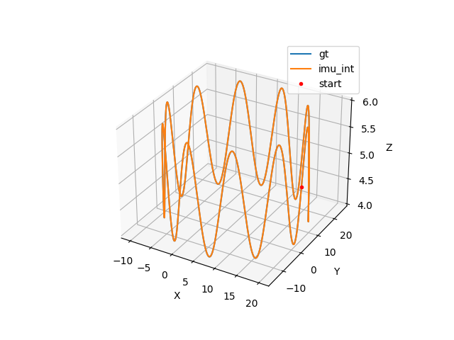
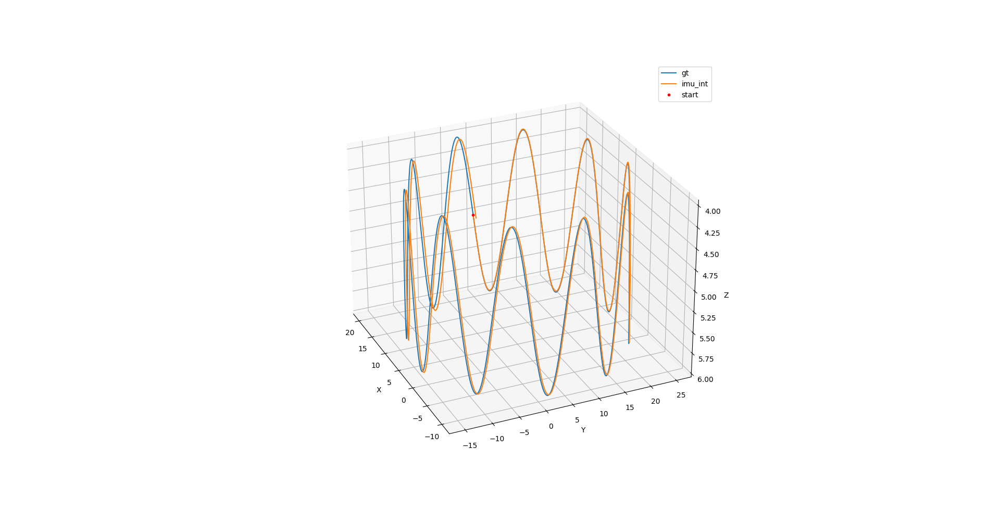

首先，在vio_data_simulation/src/param.h中，我们看到代码块

```c++
// noise
double gyro_bias_sigma = 0.00005;
double acc_bias_sigma = 0.0005;

//double gyro_bias_sigma = 1.0e-5;
//double acc_bias_sigma = 0.0001;

double gyro_noise_sigma = 0.015; //*14 = 0.21   // rad/s * 1/sqrt(hz)
double acc_noise_sigma = 0.019;//=*14 =  0.26      //　m/(s^2) * 1/sqrt(hz)
```

这里的sigma对应的是连续时间的参数，因为之后我们分析得到的是离散时间的参数，根据他们之间的关系，（根据vio第二讲28页）我们需要考虑sqrt(t)的转换，在代码comment中，我们写下了期待的值。

通过运行imu_util,我们得到了对应的估计值。这里，我们只关注white noise（后缀为r_n），因为随机游走无法被imu_util估计。  

```yaml
type: IMU
name: xsens
Gyr:
   unit: " rad/s"
   avg-axis:
      gyr_n: 2.1176887766246177e-01
      gyr_w: 8.6292148316809961e-04
   x-axis:
      gyr_n: 2.0989592594613488e-01
      gyr_w: 7.7688806776536102e-04
   y-axis:
      gyr_n: 2.1635061175482351e-01
      gyr_w: 7.9385735151206492e-04
   z-axis:
      gyr_n: 2.0906009528642697e-01
      gyr_w: 1.0180190302268729e-03
Acc:
   unit: " m/s^2"
   avg-axis:
      acc_n: 2.6814690283291920e-01
      acc_w: 3.5462638301274746e-03
   x-axis:
      acc_n: 2.6638199568686144e-01
      acc_w: 3.6382371890916186e-03
   y-axis:
      acc_n: 2.6758849150072089e-01
      acc_w: 3.6265735622311728e-03
   z-axis:
      acc_n: 2.7047022131117526e-01
      acc_w: 3.3739807390596320e-03

```

把数据和我们之前的预测值对比，可以看到还是很准确的。

**加速度计Allan variance**



**陀螺仪Allan variance**



Based on vio_data_simluation, the following curves show the performance of the two methods. From the observation, the performance of the mid_val method is better, because the curve is completely overlapped with the ground truth.

**Mid-val Method**




**Euler Method**



 