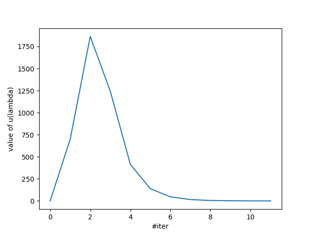
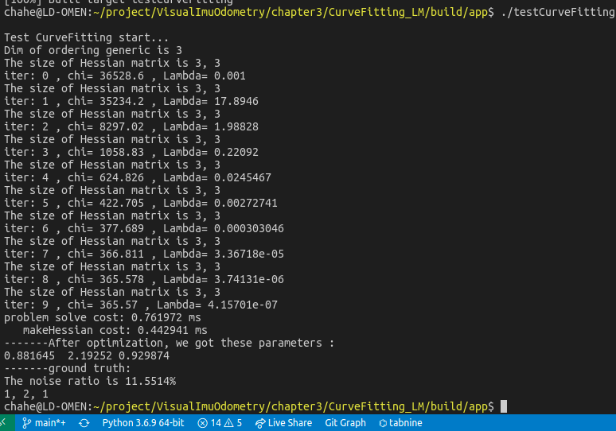
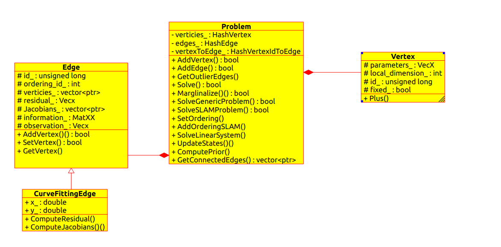

# 作业报告

1. 通过在在代码中添加输出数据流将曲线迭代优化数据存储到data.txt中，然后利用python脚本画图。观察图可以发现，刚开始lambda的数据增大，后来减小。有理论可知，当lambda偏大时，梯度方向接近最速下降法，偏小时，梯度方向接近高斯牛顿法。



2.在代码中对于原函数形式进行修改，并且修改了对应残差，和jacobian。在修改后发现，估算得到的参数误差偏大，分析后认为是添加的噪声过大导致信号信噪比偏小，因此优化效果较差。随后，通过增强原有信号的方式(a=10,b=20,c=10)，观察发现利用最小二乘估计的信号也有了更准确的估计，对应结果是

10.6107 19.6184 9.99517

3. 实现了论文 The Levenberg-Marquardt algorithm for nonlinear least squares curve-fitting problems中第一种方法，包括论文中公式（13）（16）以及4.1.1.1的实现。具体指：

* 根据（13），调整阻尼因子对于H矩阵的修改，对于对角元素添加lambda×原来的对角元素
* 根据（16），修改代码中rho的求解方法
* 根据4.1.1.1，修改lambda初始值，根据观察，发现当取1e-3时，效果最好。
* 根据4.1.1.1，修改lambda迭代策略，根据观察，算法复杂度较低。
* 对应结果：

从结果上来看，并没有明显优化，并且根据观察发现，当样本数字过大，或者参数初始值距离真值过大时，因为残差过大，系统会停止处理。修改后算法的优点在于迭代次数相对简单，但是，lambda的初始值选择也需要谨慎。




### LM代码解析：

首先看一下代码所涉及到的类的组成



再来看一下代码的流程

在main函数中，

1. 定义了模拟的曲线的真值，a,b,c
2. 初始化问题（problem），Noise
3. 初始化顶点（vertex），提供a,b,c初始值，并**把顶点添加到问题中**，顶点对应的是要估计的参数

   ```
   注意，这里对应的是一个CurveFittingVertex的子类，在这里我们可以
   ```

   **根据题意**调整Jacobian和Resiudal
4. 进入N次观测的循环

   1. 每次提供一个添加噪声的观测值
   2. 将观测存入一个**新的edge对象**中
   3. 对edge添加vertex
   4. 将Edge加入Problem中
5. Solve

   1. setOrdering();统计优化变量的维度，在本例中是3
   2. MakeHessian()

      1. 初始化Hessian矩阵
      2. 遍历edge；遍历edge的verticies（只有一个）更新Hession；
   3. ComputeLambdaInitLM() 根据Hession矩阵得到lambda初始值

      记下来进入迭代，指导iter超过10
   4. SolveLinearSystem（） 得到delta_x_(*这里可以优化速度*)
   5. RemoveLambdaHessianLM（）减去lambda，还原Hessian
   6. UpdateStates(): 用delta_x_迭代状态
   7. IsGoodStepInLM（）判断刚才的步骤是否减小了损失函数，如果否，取消刚才的步骤
   8. MakeHessian：更新hessian矩阵顶点对应的是要估计的参数
