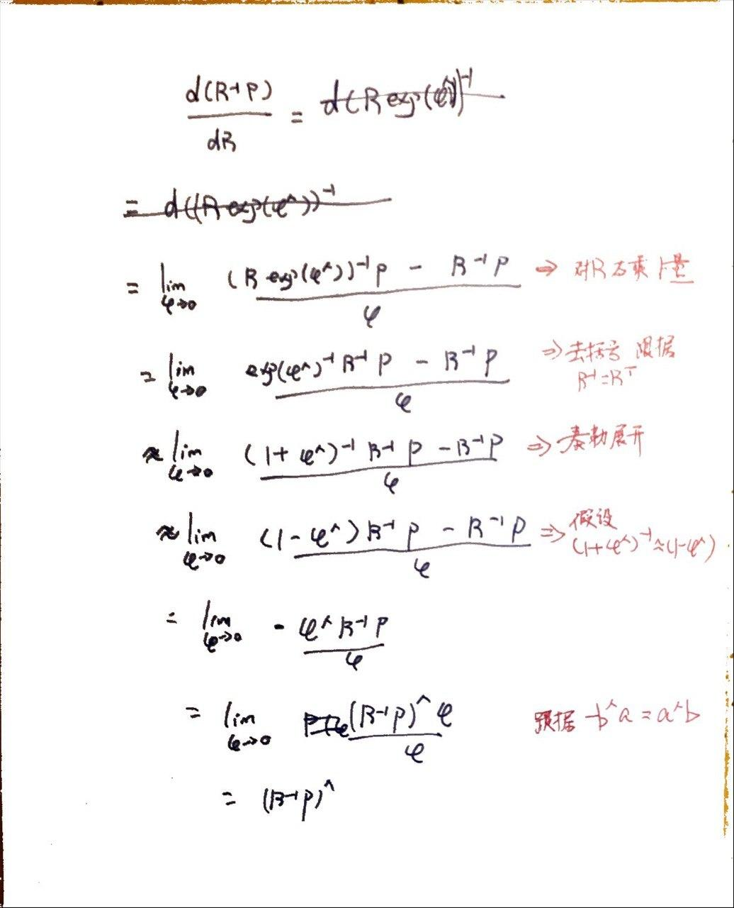
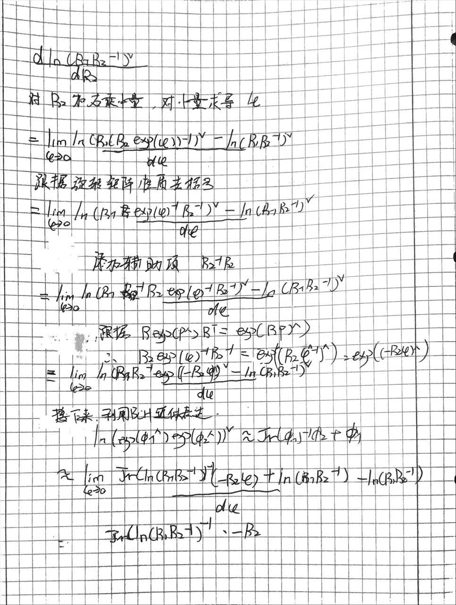

1. 
   1. 当外界视觉纹理较少，光照变化，移动速度过快时，视觉估计容易出现失效。imu可以提供短时间的高频率信息，但是长时间会出现累计误差。两者各有利弊，所以融合会提升效果。
   2. 常见的视觉imu融合方案据我了解有vins-mono，是否在工业界有应用目前不太了解
   3. 目前有deepVIO这种基于学习的方法。 也有比如LVI-sam这种除了视觉imu还融合了lidar的方案

2. 对李代数和旋转矩阵用小量更新。

通过程序实践，发现两者的差别确实小，小数点后六位级别。

源码：见https://github.com/grobothero/slambook2/blob/master/ch3/quaternion/quaternion.py

```
The initial rotation matrix is 
 [[1. 0. 0.]
 [0. 1. 0.]
 [0. 0. 1.]]
Rotation based on rotation matrix
Result after multi with exp 
 [[ 0.99935008 -0.02989301  0.02014532]
 [ 0.03009299  0.99950006 -0.0096977 ]
 [-0.01984535  0.01029763  0.99975003]]
Result after quanternion multiplication
 [[ 0.99935 -0.0299   0.02015]
 [ 0.0301   0.9995  -0.0097 ]
 [-0.01985  0.0103   0.99975]]
The diff is
  [[7.58297944e-08 6.98784389e-06 4.68383919e-06]
 [7.01117614e-06 5.83306111e-08 2.29817164e-06]
 [4.64884083e-06 2.36816837e-06 2.91653055e-08]]
```



ee